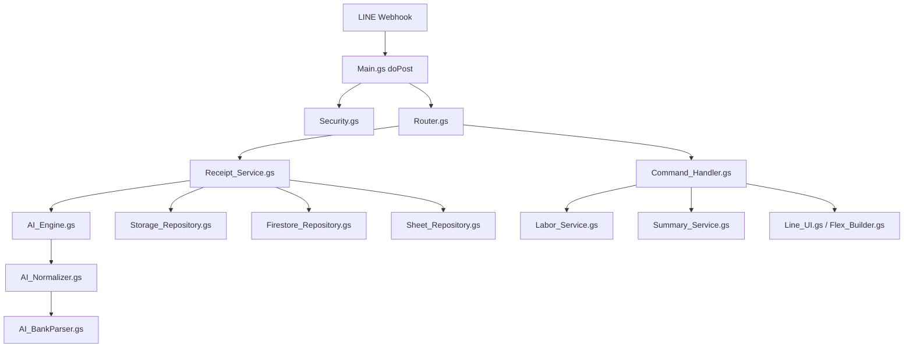
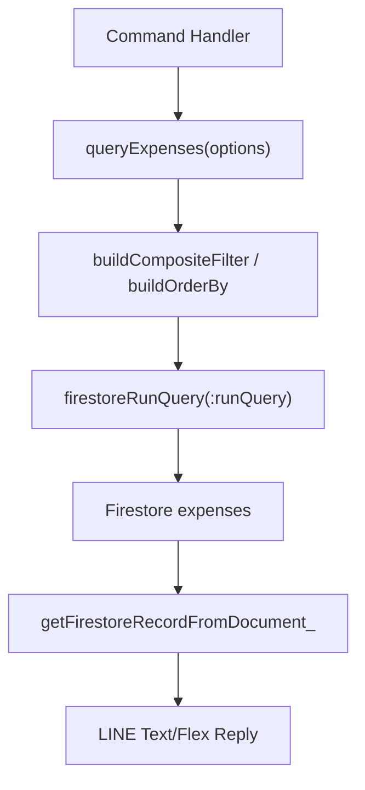

# Architecture

This file is optional reference material. The required operational docs are `COMMANDS.md`, `DEPLOYMENT.md`, `DATABASE_SCHEMA.md`, `SHEET_SCHEMA.md`, and `MAINTENANCE.md`.

## Flow



## Indexed Query Architecture

Normal bot commands read Firestore through `Firestore_Query.gs`, not through full collection scans.



Write flow computes query keys before saving:

```text
record.date / occurredAt
  -> dateKey
  -> monthKey
  -> weekKey
record.job + JOB_ALIASES
  -> jobNameNormalized
  -> jobId
record.category + CATEGORY_ALIASES
  -> categoryId
record.merchant
  -> vendorId or workerId
record content
  -> fingerprint
status
  -> isActive
```

`getAllExpenses()` is retained only for legacy/dev maintenance and must not be used by normal bot commands.
