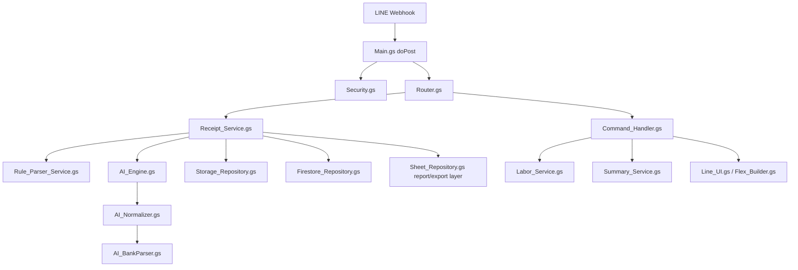
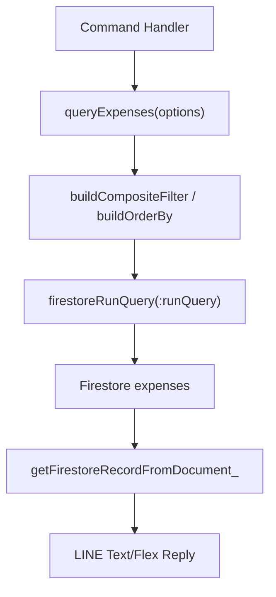
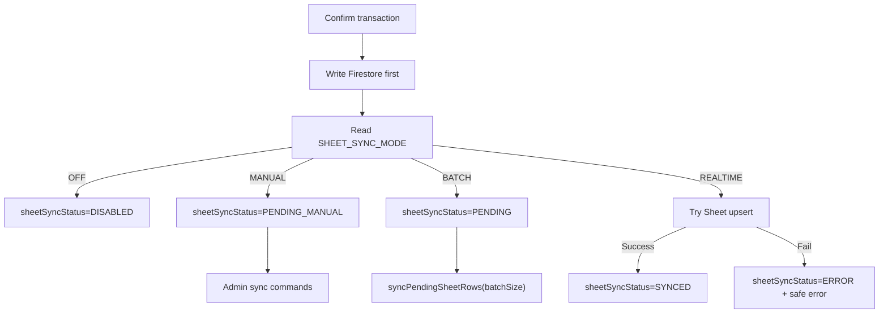
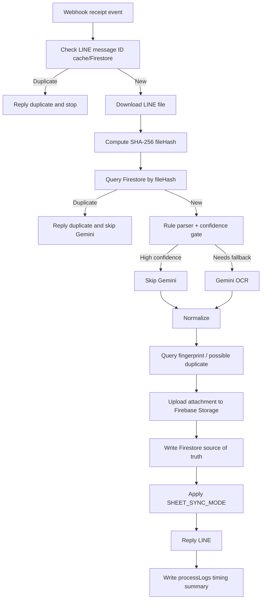

# Architecture

This file is optional reference material. The required operational docs are `COMMANDS.md`, `DEPLOYMENT.md`, `DATABASE_SCHEMA.md`, `SHEET_SCHEMA.md`, and `MAINTENANCE.md`.

## Stable Summary Query Model

Normal LINE text commands read from Firestore only. Summary commands use a fixed scope model:

```text
scopeType = FACTORY | JOB | UNKNOWN
scopeKey  = FACTORY | jobId | ""
monthKey  = YYYY-MM (factory monthly summary and active jobs only)
status    = IMPORTED
isActive  = true
```

Factory expenses use `scopeType=FACTORY`, `scopeKey=FACTORY`, and current `monthKey` for `สรุปงบ โรงงาน`. Project expenses use `scopeType=JOB` and `scopeKey=jobId` for `สรุปงบ งาน...`, intentionally without `monthKey` so multi-month projects are totaled together. Unknown rows are excluded from normal summaries and marked `reviewNeeded=true`.

Receipt/image/PDF processing is the only flow that may use `sourceMessageId`, `fileHash`, `fingerprint`, OCR, or Gemini. Text summary commands must never call duplicate-check or file-processing functions.

## Rule-First AI Flow

Receipt workers now parse deterministic text/caption patterns before using Gemini. `AI_READ_MODE` controls AI usage:

```text
OFF           = never call Gemini; incomplete data becomes PARSE_INCOMPLETE
FALLBACK_ONLY = call Gemini only when rule parsing cannot auto-confirm; recommended
ALWAYS        = always call Gemini after duplicate checks
```

Rule parsers return `parsedData`, `confidence`, `missingFields`, `warnings`, and `parseMethod`. The confidence gate writes:

```text
confidence >= 0.85 + required fields complete -> IMPORTED
confidence 0.60-0.84 or uncertain scope/conflict -> NEEDS_REVIEW
confidence < 0.60 or missing amount/date/type -> PARSE_INCOMPLETE
```

Required fields for auto-save are `amount`, `type`, `date`, valid `scopeType/scopeKey`, and passed duplicate checks. If scope is unknown, the bot does not guess a project and stores the transaction for review.

See `docs/FIRESTORE_QUERY_CATALOG.md` for the approved query shapes and required indexes.

## Flow



## Indexed Query Architecture

Normal bot commands read Firestore through `Firestore_Query.gs`, not through full collection scans.



Write flow computes query keys before saving:

```text
record.date / occurredAt
  -> dateKey
  -> monthKey
  -> weekKey
record.job + JOB_ALIASES
  -> jobNameNormalized
  -> jobId
jobNameNormalized == โรงงาน
  -> costCenter=FACTORY
  -> scope=FACTORY
  -> scopeType=FACTORY
  -> scopeKey=FACTORY
  -> isFactoryExpense=true
known customer job
  -> scopeType=JOB
  -> scopeKey=jobId
unknown scope
  -> scopeType=UNKNOWN
  -> reviewNeeded=true
record.category + CATEGORY_ALIASES
  -> categoryId
record.merchant
  -> vendorId or workerId
record content
  -> fingerprint
status
  -> isActive
```

`getAllExpenses()` is retained only for legacy/dev maintenance and must not be used by normal bot commands.

`สรุปงบ โรงงาน` is routed to `handleFactorySummaryCommand()` and queries by `scopeType=FACTORY`, `scopeKey=FACTORY`, and current `monthKey`. `สรุปงบ งาน...` is routed to `handleJobSummaryCommand()` and queries by `scopeType=JOB` and `scopeKey=jobId` without `monthKey`.

The `fileHash` query belongs only to the receipt duplicate guard:

```text
processReceipt()
  -> fetchLineFileAsBase64()
  -> getTransactionByFileHash_()
```

Summary commands must not call the `fileHash` duplicate lookup.

## Sheet Sync Architecture

Firestore is the source of truth. Google Sheets is only a report/export snapshot and must not be used to calculate bot command responses.



Sheet sync writes only lightweight report fields such as date, type, job, category, merchant, amount, status, note, storageUrl, display name, sync status, and transactionId. Heavy fields such as OCR raw text, Gemini raw response, raw file data, storage metadata, audit details, and debug logs are not written to Sheets.

## Duplicate and Performance Flow



`processLogs` stores stage timings only. It must not store tokens, raw files, or full OCR payloads.

Command errors use the same safe logging rule. The user-facing LINE reply contains only an `ERR-xxxx` reference ID, while `auditLogs` and `processLogs` store redacted debugging fields such as `commandName`, `functionName`, `queryName`, `safeErrorMessage`, and `stackTrace`.

## Silent Receipt Notification Flow

Receipt image/PDF submission now uses **Silent Receive + Done Flex Card**.

This supersedes any older queue-ack behavior:

```text
LINE image/file/pdf event
  -> doPost verifies and creates receipt_jobs
  -> no "received file" reply when RECEIPT_ACK_ENABLED=false
  -> worker processes receipt_jobs
  -> worker writes Firestore transaction
  -> worker sends exactly one done/duplicate/incomplete/error notification
```

Notification delivery uses:

```text
RECEIPT_DONE_NOTIFY_MODE=REPLY_THEN_PUSH
replyMessage if replyToken is still usable within 55 seconds
pushMessage only when replyToken is expired/unavailable and push is enabled
```

The job field `notificationStatus=SENT` prevents duplicate done messages for the same receipt job. Text commands are not affected by silent mode and still reply normally.

Notification logs are written to `processLogs` with `processName=receipt_notification`. Logs store method/status/reason/message type only and never store the full `replyToken`, LINE token, API key, or secrets.

# Runtime Queue Architecture

Receipt image/PDF processing now uses a lightweight webhook plus Firestore queue model.

## doPost Lightweight Flow

`doPost(e)` should stay short:

1. Validate webhook/config/permission.
2. Route text commands directly to `handleTextMessage()`.
3. For LINE image/PDF/file events, run only line-message duplicate checks.
4. Create a `receipt_jobs` document with `status=QUEUED`.
5. Do not send a queued acknowledgement when `RECEIPT_ACK_ENABLED=false`.
6. End the webhook request.

The webhook must not run Gemini OCR, Firebase Storage upload, large PDF processing, batch Sheet sync, or long loops.

## Receipt Worker Flow

`processPendingReceiptJobs(batchSize)` is the worker entry point. Run it manually from Apps Script or attach it to a time-driven trigger.

Worker flow:

1. Acquire `LockService` script lock.
2. Load up to 3 queued/retry jobs by default.
3. Lock each job as `PROCESSING`.
4. Download LINE file.
5. Check `fileHash` duplicates before parsing.
6. Parse caption/filename/rule text first.
7. Run Gemini only when `AI_READ_MODE` allows it and rule confidence is not enough.
8. Check `fingerprint` and possible duplicate when the parsed record has enough data.
9. Save the transaction to Firestore with parser metadata.
10. Set Sheet sync status according to `SHEET_SYNC_MODE`.
11. Mark the job `COMPLETED`, `DUPLICATE_SKIPPED`, `RETRY_PENDING`, `PROCESSING_PAUSED`, or `FAILED`.
12. Send one completion card using reply first when possible, then push fallback when enabled.

## Runtime Guard

`RuntimeGuard_Service.gs` prevents hard Apps Script timeout. Long workers call `assertCanContinue(stepName)` between heavy stages. If remaining time is low, processing stops intentionally and the job is marked for retry instead of letting GAS terminate silently.

## Locks

`LockService` is used for:

- `processPendingReceiptJobs`
- `syncPendingSheetRows`
- `retrySheetSyncErrors`

This prevents duplicate job processing and concurrent Sheet writes.

## UrlFetch Metrics

All outbound calls should go through `safeUrlFetch()`. It records:

- `urlFetchCount`
- `geminiCallCount`
- `firestoreReadCount`
- `firestoreWriteCount`
- `sheetWriteCount`
- `lineReplyCount`

Logs are written to `processLogs` without tokens or secrets.
